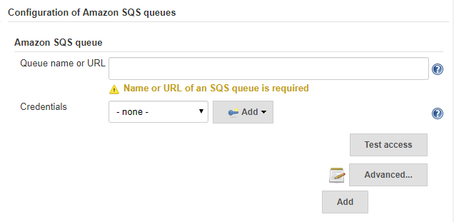
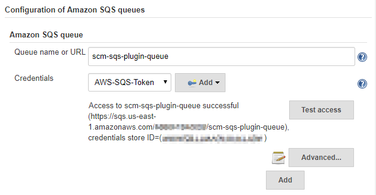

# Amazon SQS Plugin for Jenkins

A Jenkins plugin that allows using Events sent to Amazon Simple Queue Service (SQS) as a build trigger.

Allows default IAM access (no access/security keys required).

To use this plugin you will need to have the following:

## N.B. This readme is currently out of date

1. An Amazon Web Services (AWS) account
2. A Simple Queue Service (SQS) queue
3. A user that is allowed to access the queue

# Table of contents
1. [Using the plugin](#using-the-plugin)
    1. [Install the plugin](#install-the-plugin-on-jenkins)
    2. [Set up AWS users](#create-a-jenkins-user-on-aws)
    4. [Create an SQS queue](#create-an-sqs-queue-on-aws)
    5. [Test access to the queue](#test-whether-jenkins-can-access-the-queue)
    9. [Configure Jenkins jobs](#configure-jobs-to-use-the-queue-on-jenkins)
    10. [Test your setup](#test-your-setup)
2. [Development](#development)
2. [Release](#release)
3. [License](#license)
4. [Maintainers](#maintainers)

## Using the plugin

This setup assumes that you already have an AWS account and that you're able to log in to your AWS account. You must also be able to manage users and groups, an SQS queue. If you don't have the necessary permissions find someone who does.

### Install the plugin on Jenkins

1. Go to `Jenkins > Manage Jenkins > Manage Plugins`.
2. Go to `Available` and search for `amazon-sqs` or `amazon sqs`.
3. Install the plugin and restart your Jenkins.

After you've successfully installed the plugin you should see a new entry in your global Jenkins configuration. Go to `Jenkins > Manage Jenkins > Configure System` to verify. You should be able to find an entry similar to the one below.



### Create a Jenkins user on AWS

1. Log in to your [Amazon Web Services](https://aws.amazon.com/) account.
2. Go to `Services > Security & Identity > IAM`
3. **Create** a **new group** called *Jenkins*
4. Assign the following managed policies to the user:

    * AmazonSQSFullAccess

    The `AmazonSQSFullAccess` policy is required for Jenkins to be able to read messages from queues and to delete messages from queues once they've been processed.

5. **Create** a **new user** called *Jenkins*
6. Assign the *Jenkins* user to the *Jenkins* group
7. Go to `IAM > Users > Jenkins > Security Credentials`
8. **Create** a new **Access Key** for the Jenkins user

    **Important:** You will need the `Access Key ID` and `Secret Key` for Jenkins to be able to access the SQS queue. Make sure to save both values in a secure place.

### Create an SQS queue on AWS

1. Go to `Services > Application Services > SQS`

2. **Create** a **new queue**

    At the very least you'll need to enter a new name for the queue. If you already have a repository something like **_repository-name_-queue** is a good idea. So for the *amazon-sqs-plugin* repository we would use *amazon-sqs-plugin-queue*.

    Review the remaining options and adjust them to your needs. If you do not know what these options do just leave them at their defaults.

3. Copy the *ARN* of the queue for later

### Create a Jenkins credentials object

Amazon SQS queue use text security credentials pair Access key ID and Access key secret. You can use the pair previously created as described in section **Create a Jenkins user on AWS**. You have to put AWS SQS credentials pair into **Secret text** kind of Jenkins credentials store object, Access key ID as ID and Access key secret as Secret. Amazon-SQS-plugin use plain text credentials and only this kind of credentials objects are visible for the plugin.

**Note:** The Credentials drop down list will show You the Description You wrote to Jenkins credentials store object.

### Test whether Jenkins can access the queue

1. Go to `Jenkins > Manage Jenkins > Configure System` on your Jenkins

2. Go to `Configuration of Amazon SQS queues`

3. Configure a queue

    * Enter the name of the queue you just created
    * Select the appropriate *Credentials* of the Jenkins user on AWS from drop-down list

4. Click on **Test access**

You should see a success message as in the screenshot below. If you get an error message make sure you entered the credentials correctly. If you still see errors double check the user, group and permissions you set up on Amazon Web Services.



### Configure jobs to use the queue on Jenkins

1. Go to `Jenkins > $job`
2. Click on `Configure`
3. Scroll down to `Build Triggers`
4. Check `Trigger build when a message is published to an Amazon SQS queue`
5. Select the queue you created previously

To reduce cost the Jenkins plugin does not start monitoring a queue until at least one job has been configured to listen to messages from a queue.

You can use the same queue for multiple jobs or you can create a new queue for each job. Keep in mind that monitoring multiple queues will increase the amount of requests your Jenkins will have to send to AWS. Unless you have specific needs reusing the same queue and topic for multiple jobs is completely acceptable. For billing purposes it may be easier to use multiple queues, especially if you're running builds on behalf of a customer.

### Test your setup

If you've set up everything correctly pushing a change to data on Amazon SQS should now trigger a build on Jenkins. If nothing happens, make sure the job has been set to use messages posted to SQS as a build trigger.


# Development
1. Start the local Jenkins instance:

    mvn clean compile hpi:run

2. Wait until "Jenkins is fully up and running" is shown in the terminal
   (there may be more messages after that)
   
3. Open http://localhost:8080/jenkins/ in the browser


# Release

## One time settings setup:

1. login into artifactory at: https://repo.jenkins-ci.org
1. browse to repository "releases", and generate settings file using your own credentials
1. save the file under repo root folder as `settings-release.xml`

## Each release:

```Shell
mvn \
    -s settings-release.xml \
    release:prepare \
    release:perform
```

# License
Apache License, Version 2.0
```
Copyright 2016 M-Way Solutions GmbH

Licensed under the Apache License, Version 2.0 (the "License");
you may not use this file except in compliance with the License.
You may obtain a copy of the License at

     http://www.apache.org/licenses/LICENSE-2.0

Unless required by applicable law or agreed to in writing, software
distributed under the License is distributed on an "AS IS" BASIS,
WITHOUT WARRANTIES OR CONDITIONS OF ANY KIND, either express or implied.
See the License for the specific language governing permissions and
limitations under the License.
```

# Maintainers
- [Markus Pfeiffer](https://github.com/mpfeiffermway) (M-Way Solutions GmbH) – 2016
- [Nick Grealy](nickgrealy@gmail.com)
- [Victor Timohin](vvt@opsguru.io)
- [Max Kovgan](max@opsguru.io)
- [Yoshihisa Amakata](amakata@gmail.com)